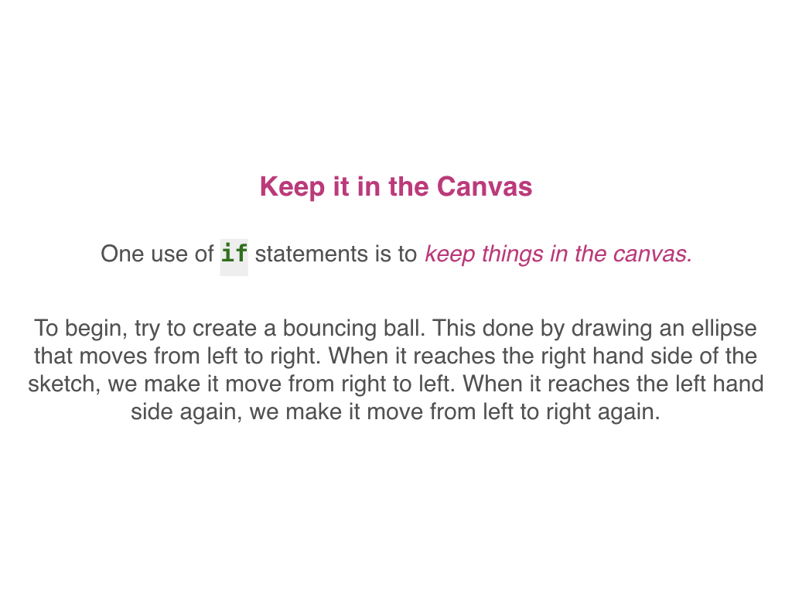

# **INTRO TO P5 & CODING- VARIABLES & INTERACTIVITY!**

### **++[SJSU Art 74 Spring 2019](https://carriehott.github.io/SJSU-Art74-Sp2019/)++**

[<Back to Tutorials](https://carriehott.github.io/SJSU-Art74-Sp2019/tutorials)

#### **Related Pages:**
* [Interactive Art Lecture](https://carriehott.github.io/SJSU-Art74-Sp2019/tutorials/Interactive_Art)
* [p5 Drawing Basics Tutorial](https://carriehott.github.io/SJSU-Art74-Sp2019/tutorials/Intro_CodeArt/)
* [p5- Complex Shapes and Color](https://carriehott.github.io/SJSU-Art74-Sp2019/tutorials/Intro_CodeArt_Color)
* [p5- Adding Images](https://carriehott.github.io/SJSU-Art74-Sp2019/tutorials/Intro_CodeArt_Images)
* [p5- Put on GitHub](https://carriehott.github.io/SJSU-Art74-Sp2019/tutorials/Intro_CodeArt_GitHub)

#### **Other Resources:**
* [p5js.org](https://p5js.org/)
* [p5js.org Code Reference Library](https://p5js.org/reference)
* [Coding Train YouTube Channel- p5](https://www.youtube.com/playlist?list=PLRqwX-V7Uu6Zy51Q-x9tMWIv9cueOFTFA)
 

#### **On this page:**
1. [What's a Variable?](#what-is-a-variable)
2. [mouseX and mouseY](#mouseX-and-mouseY)
3. [mousePressed](#mousePressed)
4. [Make Your Own Variable](#make-your-own-variable)
5. [Adding Math](#adding-math)
6. [Variable Scope](#variable-scope)
7. [Conditional Statements](#conditional-statements)
8. [Keyboard Input](#keyboard-input)
9. [Logical Operators](#logical-operators)
10. [Width, Height, and Bounce!](#width-height-and-bounce)
11. [Create Your Own](#create-your-own)

# What Is a Variable

# mouseX and mouseY

# mousePressed

# Make Your Own Variable

# Adding Math

# Variable Scope

# Conditional Statements

# Keyboard Input

# Logical Operators

##### Code to copy to the editor:

    function setup() {
      createCanvas(500, 500);
      background(200, 10, 100);
      strokeWeight(3);
    }

    function draw() {
      if (mouseX > 400) {
        //yellow
        fill(255, 255, 0);
      } else if (mouseX > 300) {
        //violet
        fill(101, 22, 232);
      } else if (mouseX > 200) {
        //green
        fill(101, 250, 182);
      } else if (mouseX > 100) {
        //pink
        fill(255, 142, 182);
      } else {
        //orange
        fill(255, 142, 0);
      }
  	  triangle(50, 400, 150, 400, 100, 480);
      quad(30, 100, 300, 450, 350, 150, 200, 50);
      }

 
 

##### Code to copy to the editor:

    function setup() {
      createCanvas(500, 500);
    }

    function draw() {
      background(200, 100, 100);
      noStroke();
      if (mouseX > 400 && mouseY > 400) {
      triangle(100, 100, 200, 100, 250, 200);
      text("Here it is", 150, 125);
    }
    }

 
 

# Width Height and Bounce

## More Resources:
## [Watch the Coding Train video on the Bouncing Ball](https://www.youtube.com/watch?v=LO3Awjn_gyU&list=PLRqwX-V7Uu6Zy51Q-x9tMWIv9cueOFTFA&index=13)

## [Check out the p5 Bounce Examples](https://p5js.org/examples/motion-bounce.html)

# Create Your Own

## [Go to the p5 Learn page on Interactivity](https://p5js.org/learn/interactivity.html)
